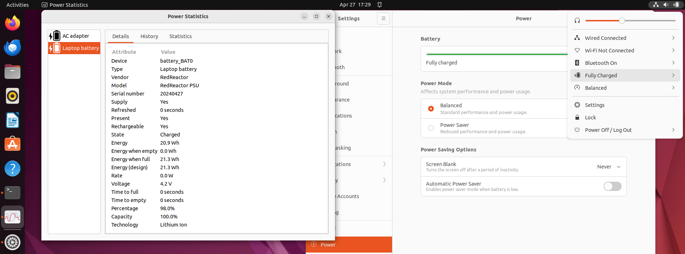
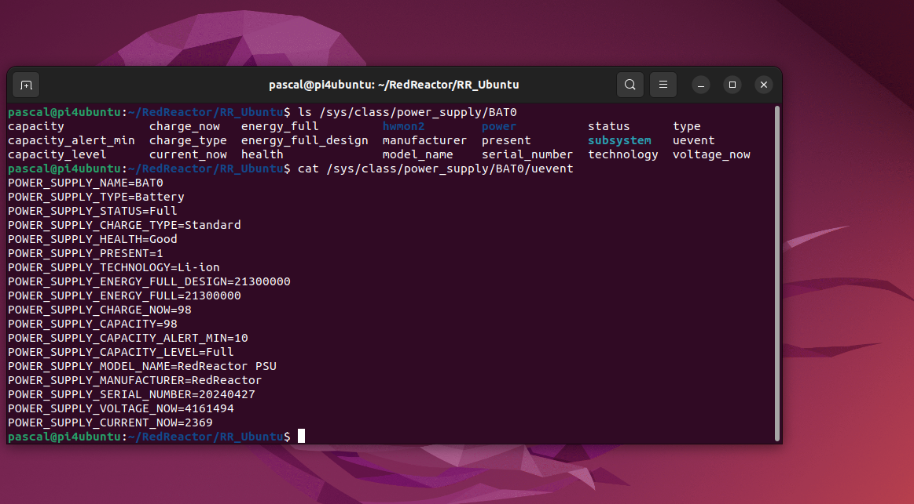
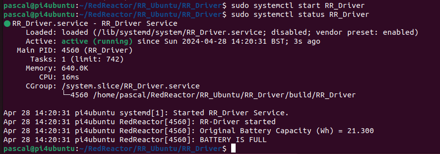
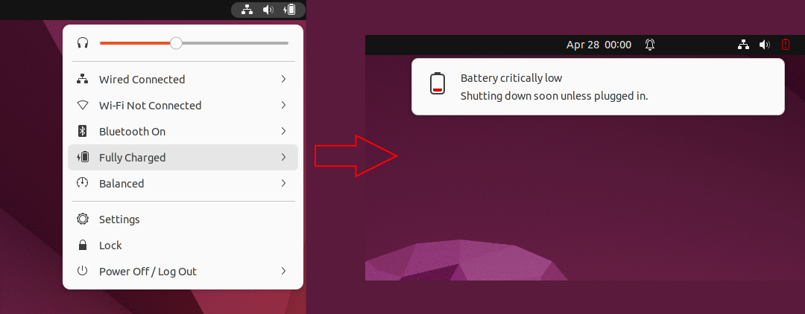

<H1>Red Reactor Linux Kernel Module and Driver</H1>



<H2>Intro</H2>
Whilst the RR_BatWay application made it possible run the Red Reactor system tray icon on Wayland, Ubuntu's goal of 
putting the system tray completely under OS control got us thinking about how to connect the Red Reactor data to the 
battery management functions built into the OS.

This was quite a steep learning process and remains a work in progress, so we appreciate any feedback you have on 
additional features and properties that this method could support.

The result is a Red Reactor OS Kernel module that defines the battery system and links the output from a Red Reactor 
device driver to the OS. The Kernel module creates a virtual device file at /dev/redreactor to which the device 
driver reports its data. Each of these reports triggers the kernel module to interpret the data and link it to the 
battery properties queried by the OS. The Kernel module defines which properties are supported, and the property data 
can be accessed by user applications via the virtual system files at /sys/class/power_supply/BAT0 and 
/sys/class/power_supply/AC0.



<H2>Installation</H2>
To update a previously downloaded RedReactor:

Open a terminal and type

```
  cd
  cd RedReactor
  git pull
```
or to install from scratch, open a terminal and type:
```
  cd
  git clone https://github.com/Scally-H/RedReactor
  cd RedReactor/RR_Ubuntu
```

<H3>Installing the Red Reactor Kernel Module</H3>

You must run the installer as root. You may find the headers are already installed on your system.
```
  sudo apt-get install linux-headers-$(uname -r)
  chmod +x ./intall.sh
  sudo ./install.sh
```
The installation script will compile the redreactor.c file and copy the kernel module into your current Linux kernel
power supply driver folder. **Note that this is specific to the current version of the kernel - if the kernel is 
updated you may need to re-run the installer to re-compile and copy the module to the new kernel version folder.**

The installation script then updates /etc/modules file to enable the redreactor module to be loaded at boot time.

Therefore, you will need to reboot, or you can manually load the module to test it by using the following commands:

``` 
# To manually load it (does not persist on reboot)
  sudo insmod redreactor.ko

# To manually unload it
  sudo rmmod redreactor
```
With the redreactor kernel module loaded you should see the battery icon appear in the system tray, but the battery
state is given by default values unless the RR_Driver is already running. The redreactor kernel module will miss the 
initial reference battery charge update if you started the RR_Driver before the kernel module is loaded.

If you would like to test the redreactor kernel module without running the RR_Driver you can manually push data to
the redreactor kernel using any of these commands, for example to see how the battery icon changes without running the
battery down (note charge is in uW, only use valid integers, and negative microamps values indicate charging):

```
  echo "capacity = 80" | sudo tee /dev/redreactor
  echo "microvolts = 4200000" | sudo tee /dev/redreactor
  echo "microamps = 2300" | sudo tee /dev/redreactor
  echo "chargedesignfull = 22200000" | sudo tee /dev/redreactor
  echo "chargefull = 21300000" | sudo tee /dev/redreactor
```

<H3>Installing the RR_Driver</H3>
The RR_Driver is a C++ code module that uses the IN219 library from https://github.com/regisin/ina219. It can be started as a systemd service at 
boot time and configured using the following settings by editing the RR_Driver.cc file.

| Parameter | Value Range | Default | Comment |
| --- | --- | --- | --- |
| INTERVAL | 1000 - 10000 | 1000 | Read battery data every n milliseconds|
| SAMPLES | 1 - 20 | 10 | Average the last n samples|
| REPORT | 1 - 60 | 10 | Report average value every n Samples|
| BATTERY_VMIN | >2.5 | 2.9 | Set shutdown voltage |
| BATSIZE | 2000-7000 | 6000 | Total Battery Capacity in mAH |


The default values will average the last 10 samples taken over 10 seconds, and report the running average every 10 
samples (in this case 10 seconds). If the battery state changes then it reports the update immediately, so it is not 
necessary to report every sample.

The RR_Driver reports the original battery capacity but adjusts the achieved capacity at the end of the first anf 
subsequent charge cycles, as the final charge voltage will vary between boards and battery characteristics. Please 
also note that charging only starts below the charging threshold voltage, which is less than the final charge 
voltage and therefore the system may show the battery as FULL but with slightly less than 100% charge.

If the driver detects the battery voltage going below BATTERY_VMIN it will enforce a safe system shutdown.

Use the following commands to build and install the RR_Driver as a system service that will restart the driver at boot 
time.

```
  cd RR_Driver
  chmod +x ./install.sh
  ./install.sh
  sudo systemctl enable RR_Driver
  sudo systemctl start RR_Driver
  sudo systemctl status RR_Driver
```
The installation script compiles the driver and there should be no compilation errors (note that the provided INA219 
source code has been tweaked to remove the errors it was generating). This creates an executable in the /build folder 
which is used by the RR_Driver.service file. The systemctl start command will run the service immediately. You can 
see the driver information from the status command. This will now restart each time the system is booted up.



Note that without the redreactor kernel module loaded the RR_Driver cannot write to the /dev/redreactor file, which is
reported to the OS system log and systemctl status.

Other Key messages from the driver (e.g., battery reach FULL state) are also reported to the OS system log. You can 
extract the driver messages using the following (which will also include any redreactor kernel messages):
```
# See all RR_Driver messages
  sudo journalctl -t RR_Driver
# See all "RR" messages including redreactor kernel logs
  sudo journalctl | grep RR
```

If you need to stop the driver at any time, use:
```
  sudo systemctl stop RR_Driver
```

If you wish to create a debug build that writes sample information and the data written to /dev/redreactor to 
stdout then you can use:
```
  make debug
```
But note that this output also ends up in the OS journalctl log, so re-run 'make' when you're done.


<H2>What will I see?</H2>

With both the RR_Driver and redreactor kernel modules running you will see the OS present a battery icon in its system 
tray, according to the battery status. On Ubuntu you can click on the battery icon to see more detail or open up the Power 
application.

When the battery is discharging and reaches 10% charge level the OS will generate a pop-up warning.



When the RR_Driver detects battery voltage has reached VMIN, it will trigger a safe shutdown.

<H3>Open Issues</H3>
Please note that this does not support all the features you might find in a laptop battery system, and therefore it 
cannot monitor / show you certain types of battery data, or support advanced power management features.

- Currently, the RR_Driver does not include battery fault detection.

- Somehow the OS did not use the TIME_LEFT properties for time to empty / full when these were calculated by RR_Driver, 
so it was left to the OS to do the calculations. However, the OS simply calculates the time left from the current capacity 
and the rate of charge/discharge, but the power statistics application appears to misuse the CURRENT_NOW data as the 
rate when RATE should be, as indicated on the status display, in uW. Hence, the time left values are quite inaccurate.

  - From https://upower.freedesktop.org/docs/Device.html it shows an EnergyRate property but this does not exist in 
    the power_supply.h file, so let me know how to fix it!
  
- The redreactor kernel module does not define a parent (which is reported to the system log) - TBD what this should 
  be?
  - However, this has no obvious impact on the kernel module.
- There are a few TODO entries in the redreactor.c file, I hope to get round to these soon!
- For now, you'll need to edit the RR_Driver file if you want to change any of the constants, including battery 
  energy and minimum voltage for shutdown - please remember to recompile when changed!
- It's possible this kernel module/driver also works in other Linux versions but for Raspberry Pi Buster/Bookworm 
  I would recommend using the provided applications in this GitHub under RR_BatWay or the RedReactor 
  pi-battery-widget which both provide more features and better icons!

<H4>References</H4>
- A great source of inspiration came from https://github.com/hoelzro/linux-fake-battery-module . No comments in the 
code but it was definitely a great help for the redreactor kernel code.
- There are some other excellent intros to writing kernel modules, not least this one 
https://embetronicx.com/tutorials/linux/device-drivers/cdev-structure-and-file-operations-of-character-drivers/ 
which is a great guide to the character driver structure reading from /dev/redreactor
- The Linux source code at https://github.com/torvalds/linux/blob/master/drivers/power/supply/power_supply_core.c is 
very useful in understanding how the redreactor kernel is called, along with the power_supply.h header file.
- The build uses a copy of the INA219 C-code driver from https://github.com/regisin/ina219 . This is unmodified except 
for minor fixes to remove compiler warnings from the sprintf statements and hence it does not get downloaded from the 
  source so if this is updated we'll check it out.
